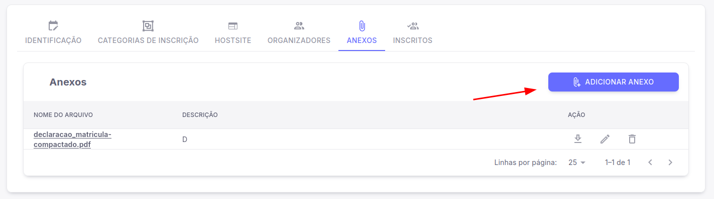
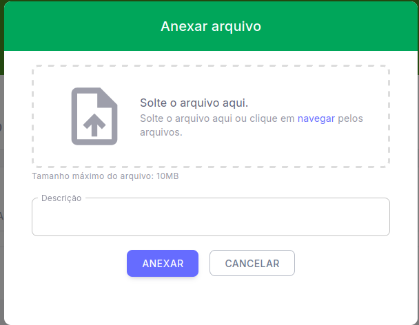

# Anexos no seu Evento

Após preenchimento das informações essenciais do seu evento no nosso Sistema do Pharus IFNMG, você como Organizador do evento conseguirá enviar anexos, editá-los e também apagá-los caso deseje. 

## Primeiros Passos

Siga os passos a seguir para você como **Organizador**, enviar os seus primeiros anexos ao seu evento.

1. Acesse "Meus eventos".

2. Selecione o evento que você deseja visualizar.

3. No menu lateral esquerdo na seção "Organizador" clique em "Evento".

4. Após clicar e abrir as opções do evento, clique em "Configurações".

5. Ao acessar as configurações será possível visualizar a aba **"Anexos"**.

6. Após selecionar a aba "Anexos" é possível visualizar o botão **"Adicionar Anexo"**

7. Irá abrir uma janela onde você conseguirá inserir o seu documento e também a descrição do mesmo.

E então clique em **"Anexar"** e o seu documento já terá sido enviado para o seu evento com sucesso!

## Editando o seu Anexo

Com o seu anexo já enviado, é possível também realizar alterações no mesmo, ao clicar no ícone do "Lápis" que é exibido na linha onde contém o *Nome e Descrição* do seu anexo, você como organizador tem acesso a mesma janela que é exibida ao adicionar um anexo, onde é possível alterar, inserir ou deletar o seu anexo! 

*Lembre-se, o tamanho limite para envio de anexo é de 10MB, como descrito abaixo do campo de inserção de anexos.*

## Artigos Relacionados

Veja também outros tutoriais úteis para organização de eventos:

- [Como criar um evento](../CriarEvento.md)
- [Adicionar organizadores ao evento](../Configura%C3%A7%C3%B5es%20Geriais%20do%20Evento/2%20-%20AdicionarOrganizadoresEvento.md)
- [Editar categorias de inscrição](../Configura%C3%A7%C3%B5es%20Geriais%20do%20Evento/1%20-%20EditarCategoriaInscricao.md)
- [Configurações de avaliação](../../Evento/Outras%20Configurações/Avaliação/1%20-%20ConfiguraçõesdeAvaliação.md)
- [Adicionar área temática](../Outras%20Configura%C3%A7%C3%B5es/Submiss%C3%B5es/AdicionarAreaTematica.md)