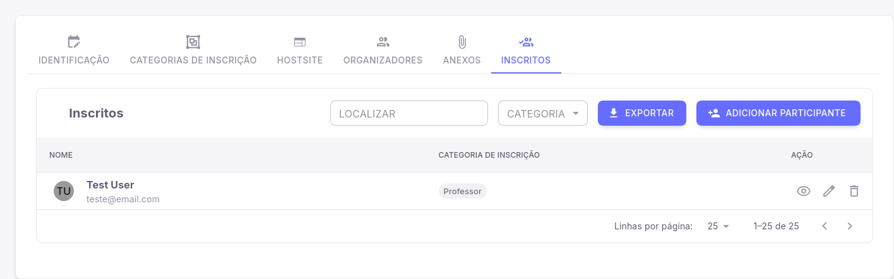

# Listagem de Inscritos de um Evento no Pharus

No sistema do Pharus, o Organizador tem acesso à visualização de quantos e quais usuários estão inscritos dentro do evento criado.
Facilitando ao usuário responsável pelo evento o acompanhamento das informações dos inscritos que estão cadastrados no seu evento.

## Acessando a listagem de inscritos do seu Evento

 Siga os passos a seguir para você como **Organizador**, conseguir visualizar os inscritos do seu evento.

1. Acesse "Meus eventos".

2. Selecione o evento que você deseja visualizar.

3. No menu lateral esquerdo na seção "Organizador" clique em "Evento".

4. Após clicar e abrir as opções do evento, clique em "Configurações".

5. Ao acessar as configurações será possível visualizar a aba **"Inscritos"**.

6. A seguir, selecionando a aba "Inscritos" é possível o organizador visualizar a listagem dos Participantes que pertencem ao seu evento.

Pronto! Você conseguirá ter acesso aos nomes, categorias e e-mail das pessoas inscritas no seu evento.

## Exportação e Adição de novos participantes

Nessa mesma tela é possível também a adição de novos participantes e a exportação dos dados dos participantes em formato PDF ou CSV, tornando mais prático para o organizador tanto exportar as informações quanto inserir participantes manualmente.
Inserindo nome, e-mail e Categoria do participante manualmente.

# Listagem de Inscritos

No sistema Pharus, a funcionalidade de listagem de inscritos permite ao organizador visualizar e gerenciar os participantes que se inscreveram no evento. Essa funcionalidade é essencial para acompanhar o número de inscritos, verificar informações e realizar ações como exportação de dados.

## Passo a passo para acessar a listagem de inscritos

1. **Acessar o evento**:
   - No canto superior esquerdo, clique em **MEUS EVENTOS** e, em seguida, em **ESTOU ORGANIZANDO**.
   - Escolha o evento ao qual deseja visualizar a listagem de inscritos e clique sobre ele.

2. **Abrir a listagem de inscritos**:
   - No menu lateral esquerdo, clique em **INSCRITOS**.
   - Visualize a lista de participantes inscritos no evento.

3. **Gerenciar inscritos**:
   - Utilize as opções disponíveis para:
     - **Filtrar inscritos**: Por categorias ou outras informações relevantes.
     - **Exportar dados**: Gere relatórios em formatos como Excel ou PDF.
     - **Editar informações**: Atualize dados dos inscritos, se necessário.

---

### Links para funções relacionadas
- [Adicionar Categoria de Submissão](../Outras%20Configurações/Submissões/AdicionarCategoriaSubmissao.md)
- [Editar Categoria de Inscrição](../Configurações%20Geriais%20do%20Evento/1%20-%20EditarCategoriaInscricao.md)
- [Adicionar Organizadores ao Evento](../Configurações%20Geriais%20do%20Evento/2%20-%20AdicionarOrganizadoresEvento.md)
