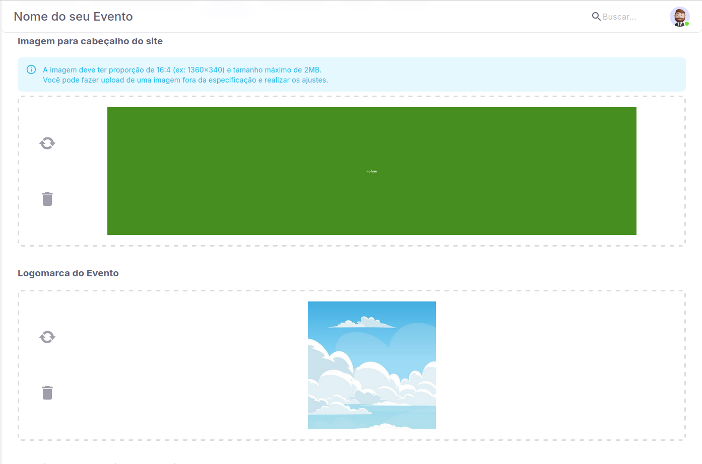
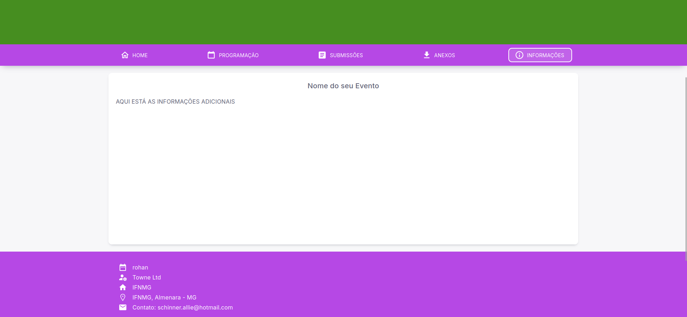

# Hostsite do seu Evento

Dentro do sistema do Pharus, na aba de configurações do evento, você pode personalizá-lo para a sua marca. É possível fazer o upload da sua logomarca, do cabeçalho, criar uma página com informações adicionais e selecionar a cor do seu evento, definindo se ele será publicado ou não.

## Primeiros passos 

 Siga os passos a seguir para você como **Organizador**, conseguir personalizar o seu evento.

1. Acesse "Meus eventos".

2. Selecione o evento que você deseja visualizar.

3. No menu lateral esquerdo na seção "Organizador" clique em "Evento".

4. Após clicar e abrir as opções do evento, clique em "Configurações".

5. Ao acessar as configurações será possível visualizar a aba **"Hostsite"**.

6. Após selecionar a aba "Hostsite" é possível o organizador visualizar os campos de envio de logomarca e cabeçalho logo no ínicio.

7. Selecione uma *imagem* a sua escolha e insira nesses campos, assim que o conteúdo for enviado será exibido uma opção de recorte para se adequar a **proporção exigida 16:4.**

## Configurações adicionais

Com a sua logomarca e cabeçalho inseridos no seu evento, vamos agora para seleção de cor e configurações adicionais que é possível visualizar dentro dessa aba.

1. Em **"Selecione a cor desejada para o site"**, é possível você selecionar a cor que deseja para representar o seu evento.

2. A seguir é possível visualizar o campo de seleção **"Publicado"**, onde você como organizaor pode definir se esse evento já foi publicado ou não.

3. Abaixo de "Publicado", temos as opções de marcação **"Página Adicional"** que ao marcar *"Sim"*, abrirá um editor de texto que é possível você inserir quaisquer informações adicionais que preferir.

*Para visualizar as informações adicionais da qual você preencheu, você pode visualizá-las ao clicar no **Nome do Evento**, ao acessá-lo quando entrar em **"Meus eventos"**. Irá abrir informações mais detalhadas do seu evento, sendo uma delas a aba de **"Informações"** que terá as informações inseridas por você.*

Após ter feito tudo que deseja nessa tela, basta clicar em **"Salvar"** e pronto! As configurações foram concluídas.
