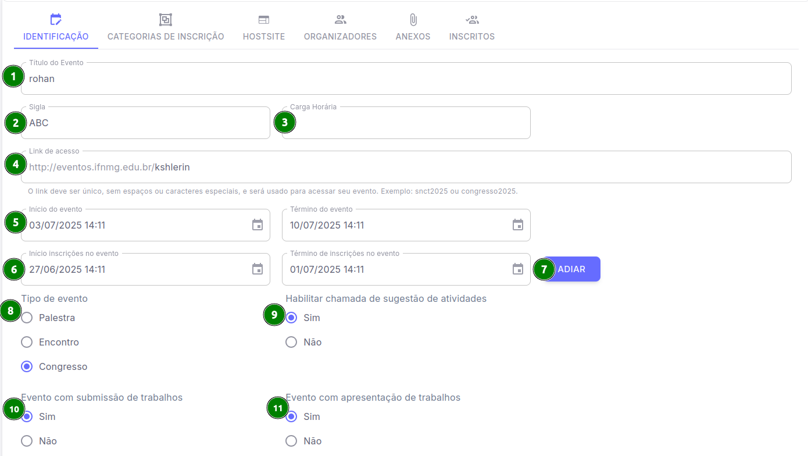
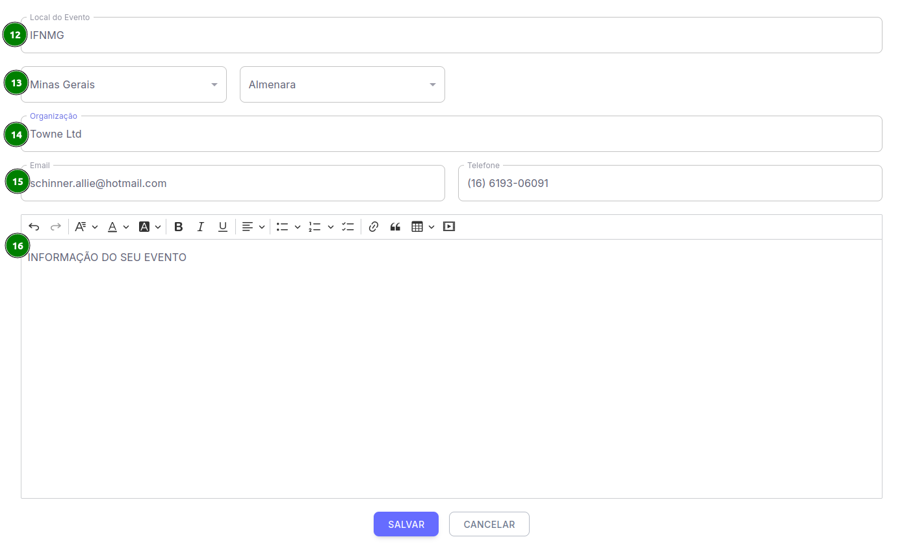

# Edição das Informações do Evento

No sistema do Pharus é possível o organizador preencher diversos campos que serão cruciais para que os usuários que visualizarem seu evento consigam ter acesso à maior quantidade de informações sobre ele, antes da sua inscrição.

## Preenchendo as informações

 Siga os passos a seguir para você como **Organizador**, conseguir estar gerenciando seu evento.

1. Acesse "Meus eventos".

2. Selecione o evento que você deseja visualizar.

3. No menu lateral esquerdo na seção "Organizador" clique em "Evento".

4. Após clicar e abrir as opções do evento, clique em "Configurações".

5. Ao acessar as configurações será possível visualizar a aba **"Identificação"**.

6. Após selecionar a aba "Identificação" é possível o organizador visualizar os campos de preenchimento que posteriormente serão muito importantes.

A seguir será possível visualizar uma demonstração dos campos disponíveis e as suas utilidades para o seu evento.

## Configurando o seu evento

Visualizando os campos presentes em "Identificação" vamos entender o propósito individual de cada um.

### Preencha todos os campos com as informações solicitadas
Informações Iniciais:

* **[ 1 ] Título**, o nome do seu evento.

* **[ 2 ] Sigla**, uma abreviação do nome do seu evento. 

* **[ 3 ] Carga Horária**.

* **[ 4 ] Link de acesso**.

* **[ 5 ] Inicio e Término do Evento**.

* **[ 6 ] Inicio e Término das inscrições do evento**.

* **[ 7 ] Adiamento das Inscrições**.

* **[ 8 ] Tipo de Evento**, uma forma de especificar se o evento se trata de uma *Palestra, Encontro ou Congresso.*

* **[ 9 ] Chamada de sugestão de atividades**.

* **[ 10 ] Evento com submissão de trabalhos**.

* **[ 11 ] Evento com apresentação de trabalhos**.

### Finalizando a configuração dos campos

<<<<<<< HEAD

=======

>>>>>>> 406998faacb19861660c75045c77e6082684f70b

* **[ 12 ] Local do Evento**.

* **[ 13 ] Cidade e Estado**.

* **[ 14 ] Organização**.

* **[ 15 ] E-mail e Telefone**.

* **[ 16 ] Informações do seu Evento**, a descrição que será exibida abaixo do título.

Após tudo estar configuado basta clicar em **"Salvar** e pronto, o seu evento foi configurado com sucesso!
