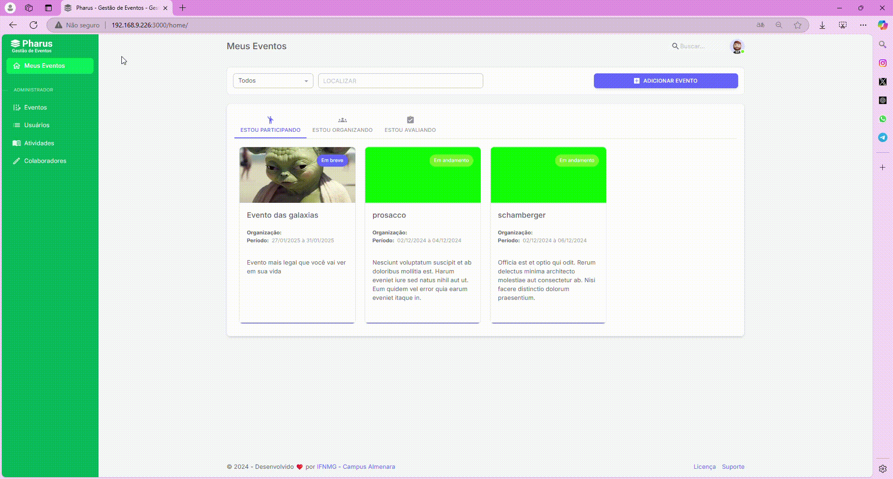

# Adicionar Locais do Evento

O PHARUS permite que você, organizador, cadastre os locais do evento de forma prática e organizada, facilitando a criação da programação e a gestão das atividades. Adicionar os locais do evento é uma etapa crucial para garantir que a programação seja clara e bem estruturada. Definir corretamente os espaços onde cada atividade ocorrerá facilita a gestão e ajuda os participantes a localizar facilmente as sessões e palestras.

## Adicionando Locais do Evento
Nesta seção, você aprenderá a adicionar locais ao sistema. Siga as etapas indicadas para cadastrar as informações corretamente, associando cada local às atividades específicas do evento.

1. Acesse "Meus Eventos" no canto superior.
2. Escolha o evento onde deseja adicionar um local e clique sobre ele.
3. No menu à esquerda, clique em "Configurações".
4. Dentro de "Configurações", clique em "Programação".
5. No novo menu, clique em "Locais".
6. Clique no botão roxo à direita com a opção "ADICIONAR LOCAL".
7. Digite o nome do local e clique em "SALVAR" para concluir.
