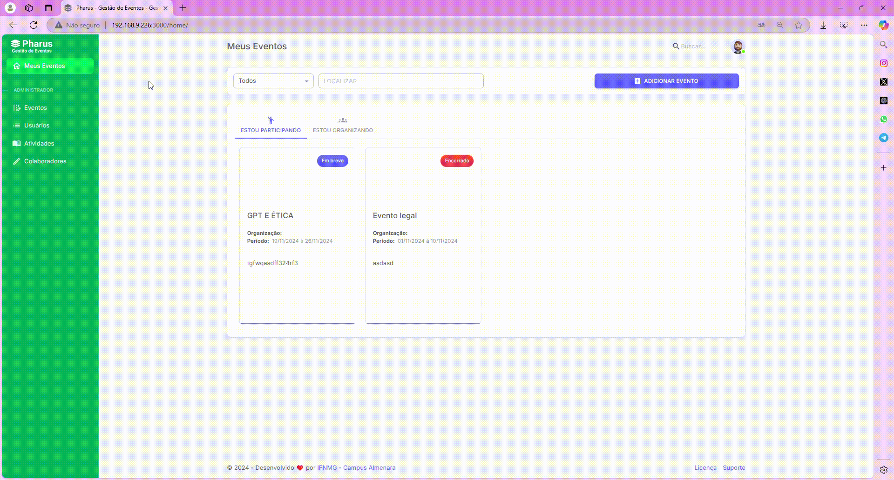
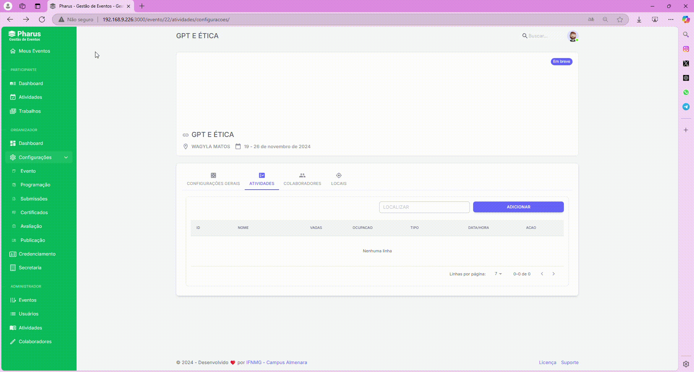
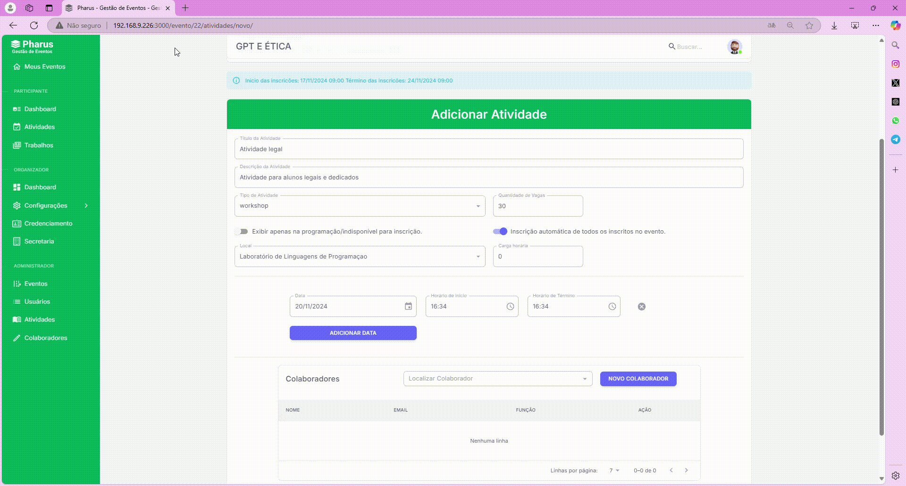

#  Cadastrando uma atividade no evento

1. Acesse "Meus Eventos": No canto superior esquerdo, clique em "Meus Eventos".                                              
2. Selecione o Evento: Escolha o evento em que deseja submeter um trabalho e clique sobre ele.                                                    
3. Clique em "Configurações": Dentro do evento, clique na opção "Configurações" que está no canto esquerdo.                                                               
4. Acesse "Programação": No menu de configurações, selecione a opção "Programação".                                                         
5. Vá para a Seção de Atividades: Localize e clique na aba "Atividades".                                  
Após os passos anteriores, o participante deve preencher as informações adicionais solicitadas a seguir. 

### Adicionar Atividade

Após chegar no menu de atividades, será exibido um novo menu com opções para selecionar o tipo de atividade que você deseja cadastrar.

1. Clique em "Adicionar": Na seção de Atividades, clique no botão roxo "ADICIONAR" para começar o cadastro da atividade.                                                                               
2. Insira o Título e a Descrição: Preencha os campos com o título e logo abaixo a descrição detalhada da atividade.                                                                             
3. Defina o Tipo de Atividade e as Vagas Disponíveis: Escolha o tipo de atividade no botão disponível e informe a quantidade de vagas que estarão disponíveis.                       
4. Configure a Exibição e Inscrição:                                                        
   • Selecione se a atividade será exibida apenas na programação como indisponível para inscrição.                                                 
    • Escolha se a inscrição será automática para todos os inscritos no evento.

Após preencher todas as informações, revise os dados e continue abaixo o cadastro da atividade.

5. Selecione ou Adicione o Local: Escolha o local da atividade ou adicione um novo local, se necessário.                                                   
6. Defina a Carga Horária: Ao lado do local, insira a carga horária da atividade.                                                              
7. Configure Data e Horários:                                                                                       
    • Selecione a data da atividade.                                                     
    • Defina o horário de início e o horário de término da atividade.                                                                                
8. Adicione ou Selecione o Colaborador: Escolha um colaborador já cadastrado ou adicione um novo colaborador para a atividade.                                                 
Após preencher todas as informações, clique em "Salvar" para concluir a submissão da atividade.