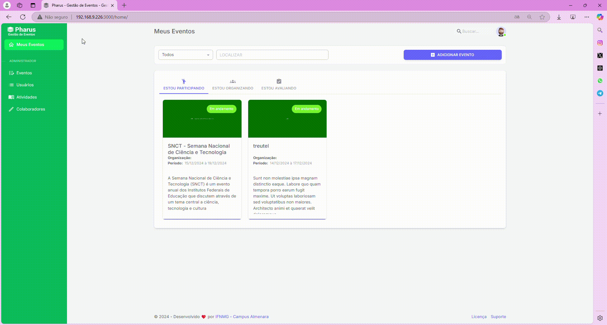

# Adicionar áreas temáticas para submissão de trabalhos

O PHARUS permite que você, organizador, adicione áreas temáticas de forma simples e organizada, facilitando a categorização e o processo de submissão de trabalhos no evento.

## Adicionando Área Temática

Siga o passo a passo abaixo para criar áreas temáticas no sistema:

1. Acesse "Meus Eventos" no canto superior.  
2. Escolha o evento no qual deseja adicionar uma área temática e clique sobre ele.  
3. No menu à esquerda, clique em "Configurações".  
4. Logo abaixo, clique em "Submissões".  
5. No novo menu, clique em "Áreas Temáticas".  
6. Clique no botão roxo à direita com a opção "ADICIONAR".  
7. Digite o nome da área temática desejada.  
8. Clique em "SALVAR" para concluir.  
Pronto! Sua área temática foi criada e já pode ser associada às submissões dos trabalhos.