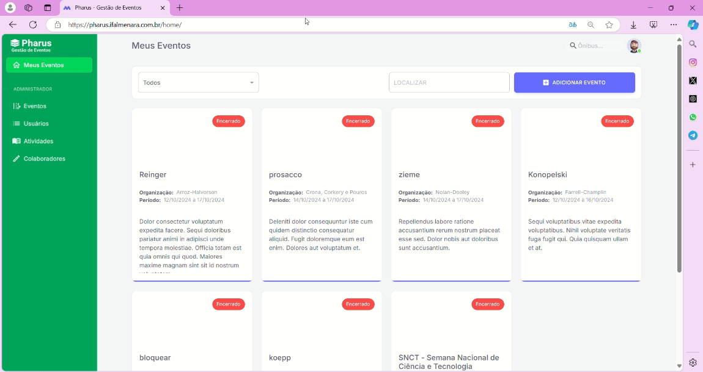
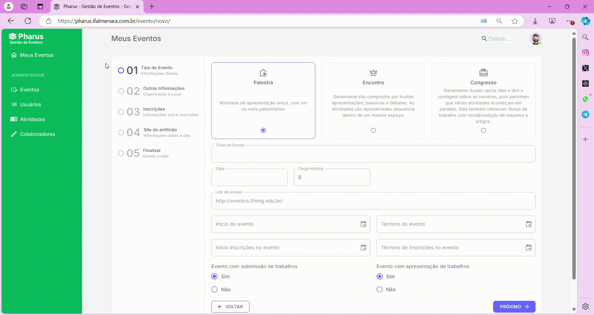
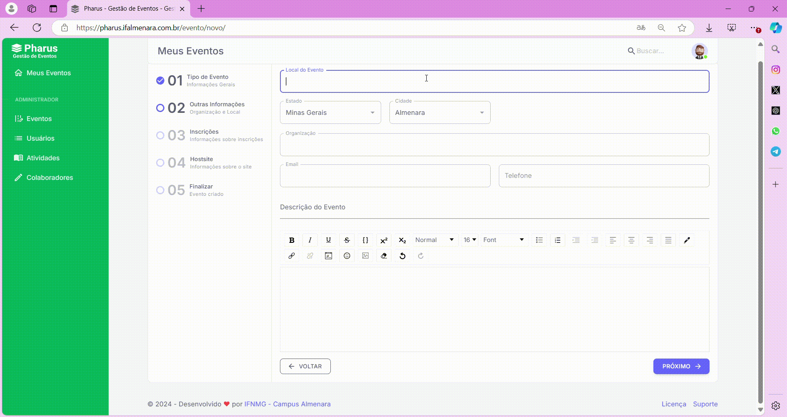
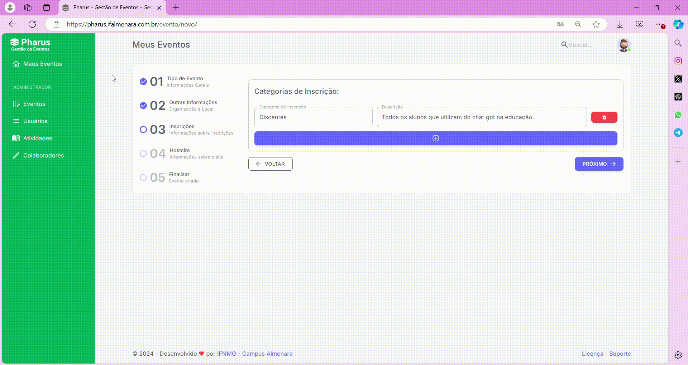

# Criar Evento

## Como criar um evento?

O **PHARUS** é uma plataforma de gestão de eventos que simplifica a criação, organização e avaliação de eventos. Para criar um evento no PHARUS, considere os seguintes pontos:

1. **Defina o objetivo e o público-alvo:** O **PHARUS** suporta diversos tipos de eventos, como congressos, palestras e encontros.
2. **Determine os detalhes do evento:** Data, local, carga horária e atividades. Um planejamento cuidadoso é essencial para o sucesso do evento.
3. **Divulgue o evento:** Informações claras e diretas facilitam a inscrição dos participantes. O **PHARUS** oferece várias opções de divulgação, incluindo páginas personalizadas e envio de e-mails.

Com esses pontos em mente, você estará pronto para criar um evento no **PHARUS** com sucesso.

## Cadastrando um evento

Antes de cadastrar um evento, siga um processo organizado para garantir que todas as informações sejam inseridas corretamente. No cadastro, você poderá definir detalhes importantes, como o tipo de atividade, os palestrantes e a programação, que serão exibidos no site. Abaixo, explicamos como realizar esse cadastro de forma simples e rápida.

1. Na tela inicial, clique no botão "**ESTOU ORGANIZANDO**".
2. Em seguida, selecione o botão azul no canto superior direito, onde está escrito "**Adicionar Evento**".

### Preenchendo Tipo de Evento

Após clicar em "Adicionar Evento", um menu será exibido com as opções de tipo de evento: **PALESTRA**, **ENCONTRO** e **CONGRESSO**. O organizador deve selecionar uma dessas opções para prosseguir com o cadastro do evento.

:::tip[Importante!]
>**Palestra**: Atividade de apresentação única, com um ou mais palestrantes.  
>**Encontro**: Composto por várias apresentações, palestras e debates, geralmente em sequência dentro de um mesmo espaço.  
>**Congresso**: Duram vários dias e permitem várias atividades em paralelo, com fluxos de trabalho para revisão/edição de resumos e artigos.  
:::

Em seguida, preencha os seguintes campos:

1. **Nome do Evento:** Insira o título completo do evento.
2. **Sigla:** Informe a sigla ou abreviação do evento.
3. **Carga Horária:** Defina a carga horária total do evento.
4. **Início e Término:** Preencha as datas e horários de início e término do evento.
5. **Período de Inscrições:** Determine o intervalo de tempo durante o qual as inscrições estarão abertas.

Indique se haverá submissão e apresentação de trabalhos, se aplicável ao seu evento. Após preencher todos os campos, clique no botão roxo no canto inferior direito, onde está escrito "**PRÓXIMO**", para avançar para a próxima etapa do cadastro.

### Outras Informações

Nesta etapa, insira informações essenciais sobre o evento, como o local de realização e os dados do organizador. Essas informações são cruciais para garantir que os participantes saibam onde o evento ocorrerá e quem será o responsável pela organização.

1. **Local do Evento:** Escreva onde o evento será realizado e selecione a **CIDADE** e o **ESTADO**.
2. **Organizador do Evento:** Preencha o e-mail e o telefone do organizador para facilitar o contato.
3. **Descrição do Evento:** Adicione uma descrição detalhada sobre o evento, destacando seu objetivo e atividades principais.

Após preencher todos os campos, clique no botão roxo no canto inferior direito, onde está escrito "**PRÓXIMO**", para avançar para a próxima etapa do cadastro.

### Categorias de Inscrição

Para definir as categorias de inscrição, organize as informações de forma clara e precisa. Esse processo permite identificar os diferentes públicos e oferecer descrições adequadas, facilitando que cada participante encontre a opção mais adequada para sua inscrição.

1. No campo "**CATEGORIA DE INSCRIÇÃO**", insira o nome da categoria do evento.
2. Em "**DESCRIÇÃO**", forneça uma breve descrição do público-alvo para essa categoria.
3. Caso exista apenas uma categoria, clique no botão roxo "**PRÓXIMO**" no canto inferior direito.

4. Para incluir outra categoria, clique no botão roxo "**ADIÇÃO**" abaixo dos campos "**CATEGORIA DE INSCRIÇÃO**" e "**DESCRIÇÃO**".
5. Insira as informações da nova categoria nos campos disponibilizados.

Após preencher todos os campos, clique no botão roxo no canto inferior direito, onde está escrito "**PRÓXIMO**", para avançar para a próxima etapa do cadastro.

### Site do Evento

Para personalizar o visual do seu evento e concluir a configuração, siga os passos abaixo:

1. Carregue a imagem do cabeçalho do site no campo "**IMAGEM PARA CABEÇALHO DO SITE**".
2. Em "**LOGOMARCA DO EVENTO**", faça o upload da logo do evento.
3. Escolha a cor do site clicando no botão "**SELECIONE A COR DESEJADA PARA O SITE**".
4. No botão "**PUBLICADO**", defina se o evento será publicado ou não.

Para finalizar a criação do evento, clique no botão roxo no canto inferior direito onde está escrito "**FINALIZAR**".
