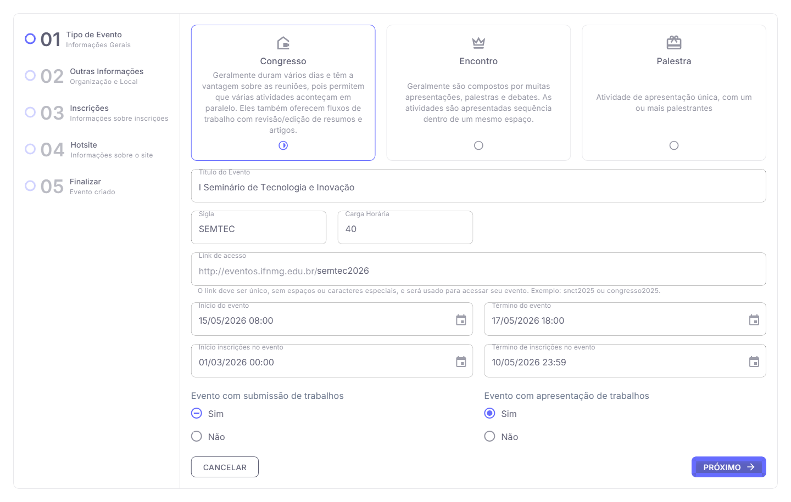
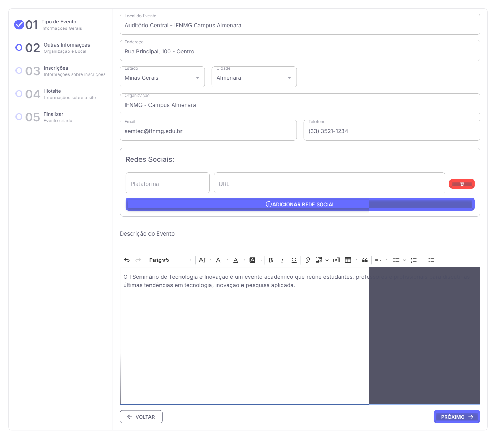
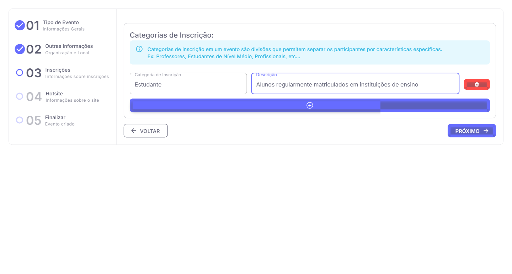
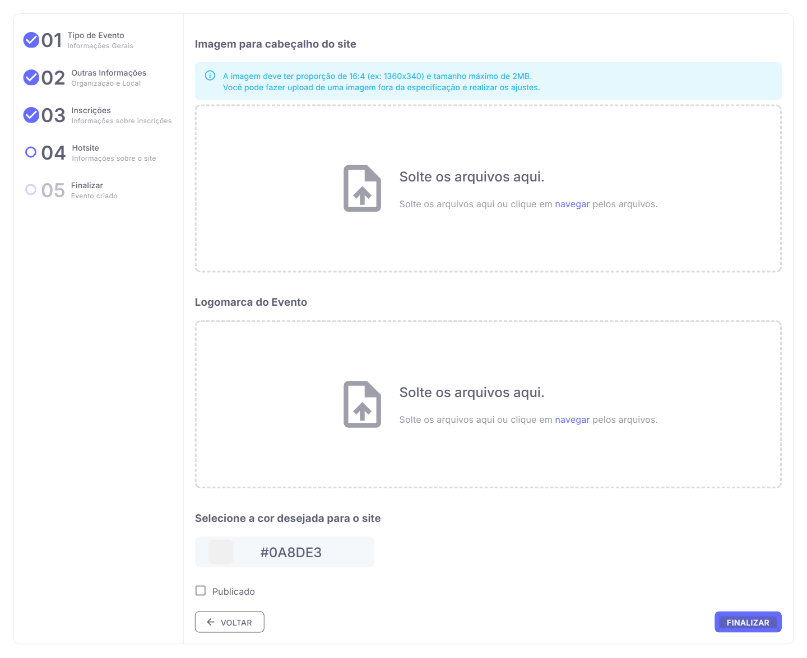

# Criar Evento

## Como criar um evento?

O **PHARUS** é uma plataforma de gestão de eventos que simplifica a criação, organização e avaliação de eventos. Para criar um evento no PHARUS, considere os seguintes pontos:

1. **Defina o objetivo e o público-alvo:** O **PHARUS** suporta diversos tipos de eventos, como congressos, palestras e encontros.
2. **Determine os detalhes do evento:** Data, local, carga horária e atividades. Um planejamento cuidadoso é essencial para o sucesso do evento.
3. **Divulgue o evento:** Informações claras e diretas facilitam a inscrição dos participantes. O **PHARUS** oferece várias opções de divulgação, incluindo páginas personalizadas e envio de e-mails.

Com esses pontos em mente, você estará pronto para criar um evento no **PHARUS** com sucesso.

## Tipos de Evento

Antes de iniciar o cadastro, é importante entender as diferenças entre os três tipos de evento disponíveis no **PHARUS**. Cada tipo possui características próprias que influenciam nas funcionalidades habilitadas para o seu evento.

| Tipo | Descrição | Submissão e Apresentação de Trabalhos |
|---|---|---|
| **Congresso** | Geralmente duram vários dias e permitem que várias atividades aconteçam em paralelo. Oferecem fluxos de trabalho com revisão e edição de resumos e artigos. | Permite habilitar submissão e apresentação de trabalhos acadêmicos |
| **Encontro** | Compostos por várias apresentações, palestras e debates. As atividades são apresentadas em sequência dentro de um mesmo espaço. | Não disponível |
| **Palestra** | Atividade de apresentação única, com um ou mais palestrantes. | Não disponível |

:::tip[Importante!]
Apenas o tipo **Congresso** permite habilitar as funcionalidades de **submissão de trabalhos** e **apresentação de trabalhos**. Ao habilitar essas opções, áreas específicas para gerenciamento de submissões e apresentações acadêmicas serão disponibilizadas no painel do evento. Se o seu evento necessita dessas funcionalidades, selecione o tipo **Congresso**.
:::

## Cadastrando um evento

Para cadastrar um evento, acesse o painel do **PHARUS** e clique no botão roxo **ADICIONAR EVENTO** no canto superior direito da tela "Meus Eventos". O sistema exibirá um formulário dividido em 4 etapas, identificadas por um menu lateral numerado (01 a 05).

### Etapa 01 — Tipo de Evento e Informações Gerais

Nesta primeira etapa, você definirá o tipo do evento e as informações básicas.

1. **Tipo de Evento:** Selecione um dos três cards disponíveis: **Congresso**, **Encontro** ou **Palestra**. Consulte a seção [Tipos de Evento](#tipos-de-evento) acima para entender as diferenças.
2. **Título do Evento:** Insira o nome completo do evento.
3. **Sigla:** Informe a sigla ou abreviação do evento.
4. **Carga Horária:** Defina a carga horária total do evento (em horas).
5. **Link de acesso:** Defina o identificador único que será usado na URL do evento. O link deve ser único, sem espaços ou caracteres especiais. Exemplo: `semtec2026` ou `congresso2025`.
6. **Início do evento / Término do evento:** Preencha as datas e horários de início e término do evento.
7. **Início inscrições no evento / Término de inscrições no evento:** Determine o período durante o qual as inscrições estarão abertas.
8. **Evento com submissão de trabalhos:** *(Apenas para Congresso)* Selecione **Sim** para habilitar a área de submissão de trabalhos acadêmicos.
9. **Evento com apresentação de trabalhos:** *(Apenas para Congresso)* Selecione **Sim** para habilitar a área de apresentação de trabalhos.

Após preencher todos os campos, clique no botão roxo **PRÓXIMO** no canto inferior direito para avançar.

### Etapa 02 — Outras Informações (Organização e Local)

Nesta etapa, insira informações sobre o local de realização, a organização responsável e uma descrição do evento.

1. **Local do Evento:** Escreva o nome do local onde o evento será realizado.
2. **Endereço:** Informe o endereço completo do local.
3. **Estado / Cidade:** Selecione o estado e a cidade nos menus suspensos.
4. **Organização:** Informe o nome da instituição ou organização responsável pelo evento.
5. **Email:** Preencha o e-mail de contato do organizador.
6. **Telefone:** Informe o telefone de contato.
7. **Redes Sociais:** Opcionalmente, adicione redes sociais do evento. Selecione a **Plataforma** no menu suspenso, insira a **URL** do perfil e clique em **ADICIONAR REDE SOCIAL** para incluir mais redes.
8. **Descrição do Evento:** Utilize o editor de texto para adicionar uma descrição detalhada sobre o evento, destacando seu objetivo e atividades principais. O editor permite formatação de texto com negrito, itálico, listas, links e imagens.

Após preencher todos os campos, clique no botão roxo **PRÓXIMO** para avançar.

### Etapa 03 — Categorias de Inscrição

Nesta etapa, defina as categorias de inscrição do evento. As categorias permitem separar os participantes por características específicas, como: Professores, Estudantes de Nível Médio, Profissionais, etc.

1. No campo **Categoria de Inscrição**, insira o nome da categoria (ex: "Estudante", "Professor", "Profissional").
2. No campo **Descrição**, forneça uma breve descrição do público-alvo dessa categoria.
3. Para adicionar mais categorias, clique no botão roxo com o ícone **+** abaixo dos campos.
4. Para remover uma categoria, clique no botão vermelho com o ícone de **lixeira** ao lado dela.

Após definir todas as categorias necessárias, clique no botão roxo **PRÓXIMO** para avançar.

### Etapa 04 — Hotsite (Site do Evento)

Nesta etapa, personalize o visual do site do evento e finalize a criação.

1. **Imagem para cabeçalho do site:** Faça o upload de uma imagem para o cabeçalho. A imagem deve ter proporção **16:4** (ex: 1360x340 pixels) e tamanho máximo de **2MB**. Arraste a imagem para a área indicada ou clique em **navegar** para selecionar o arquivo.
2. **Logomarca do Evento:** Faça o upload da logomarca do evento. Arraste a imagem ou clique em **navegar**.
3. **Selecione a cor desejada para o site:** Clique no seletor de cores para escolher a cor tema do site do evento. Você pode inserir o código hexadecimal diretamente (ex: `#0A8DE3`).
4. **Publicado:** Marque esta opção se deseja que o evento fique visível e acessível publicamente logo após a criação.

Para finalizar a criação do evento, clique no botão roxo **FINALIZAR** no canto inferior direito. O sistema criará o evento e você será redirecionado para o painel de gerenciamento.

## Links Relacionados

- [Adicionar Áreas Temáticas para Submissão de Trabalhos](../Evento/Outras%20Configurações/Submissões/AdicionarAreaTematica.md)
- [Adicionar Categorias de Submissão](../Evento/Outras%20Configurações/Submissões/AdicionarCategoriaSubmissao.md)
