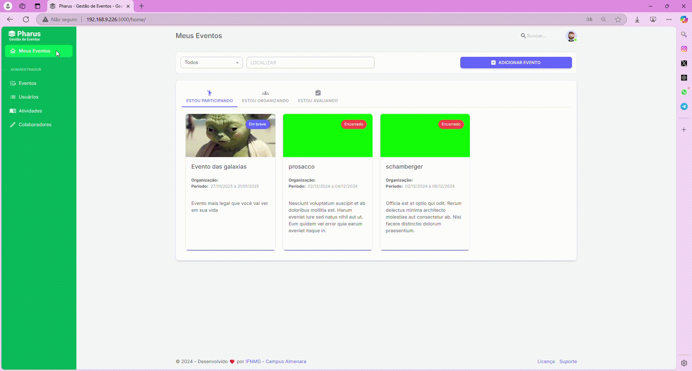

# Convidar Avaliadores

No sistema de gestão de eventos Pharus, o organizador pode convidar avaliadores para participar do processo de avaliação do evento. Essa funcionalidade facilita a colaboração e garante uma análise mais abrangente e qualificada.

## Como Convidar um Avaliador

Convidar um avaliador é um processo simples e eficiente, permitindo que você integre especialistas na avaliação das atividades do evento. Siga os passos abaixo para adicionar avaliadores ao seu evento:

1. No canto superior esquerdo, clique em **"MEUS EVENTOS"**.
2. Escolha o evento no qual deseja convidar um avaliador e clique sobre ele.
3. No menu lateral esquerdo, clique em **"CONFIGURAÇÕES"**.
4. Selecione **"AVALIAÇÃO"** para acessar as opções de gerenciamento dos avaliadores.
5. Clique em **"AVALIADORES"** para visualizar a lista de avaliadores do evento.
6. Clique no botão roxo **"ADICIONAR"** para abrir o formulário de cadastro do avaliador.
7. Preencha todos os campos com as informações solicitadas:
    * Nome completo
    * E-mail
    * Categoria
    * Áreas temáticas
    * Enviar e-mail convite (opcional)
    * Status do convite (Aceito, Pendente ou Recusado)

Após preencher todas as informações, clique no botão **"SALVAR"** na parte inferior da tela.

Pronto! O convite foi enviado com sucesso, e o avaliador agora pode participar da avaliação das atividades do evento.

---

### Links para funções relacionadas
- [Configurar Avaliadores](../Avaliadores.md)
- [Adicionar Barema](../3%20-%20Baremas/AdicionarBarema.md)
- [Configuração de Verificação na Pré-avaliação](../Pré-avaliação/Configuração%20Verificação.md)
