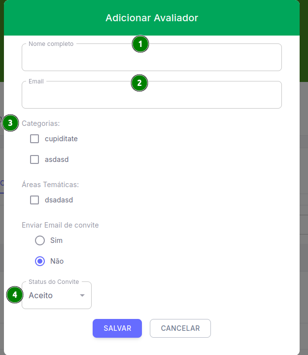
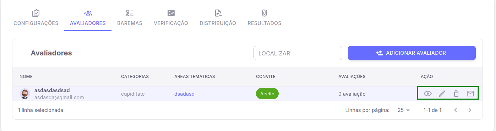

## Aba de Avaliadores
 Após realizar a configuração da aba de avaliadores, o seu próximo passo será adicionar um avaliador que será demonstrado a seguir.

 *A localização do botão de **Adicionar Avaliador** está presente no canto superior direito, acima da listagem, que ao ser clicado será exibido uma tela para preencher informações do avaliador*.

- [ 1 ] **Nome completo do Avaliador**

- [ 2 ] **E-mail do Avaliador**

- [ 3 ] **Caixas de Seleção**

1. **Categorias**
*São os tipos de trabalho que o avaliador pode ou não avaliar*.

2. **Áreas Temáticas**
*Áreas que são do conhecimento do avaliador*.

3. **Enviar e-mai de convite**
*Opção para definir se será enviado um e-mail de convite ou não para o Avaliador*.

- [ 4 ] **Status do convite**
*Caso a opção [ 3 ] esteja marcado como "não", essa opção irá demonstrar se o convite foi aceito, está como pendente ou recusado*.

## Opções de Listagem

1. **Visualizar**
*Vocẽ pode visualizar todos os campos inseridos para aquele avaliador*

2. **Editar**
*Os campos que antes você havia inserido ao adicionar o avaliador, podem ser alterados ao clicar nessa opção, com exceção do nome e e-mail*.

3. **Deletar**
*Deleta o avaliador cadastrado por você*.

4. **Reenviar Convite**
*Reenvia o convite para o avaliador*.