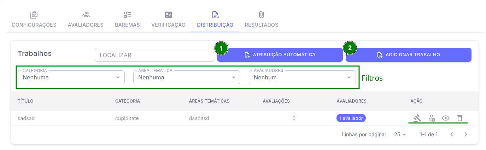
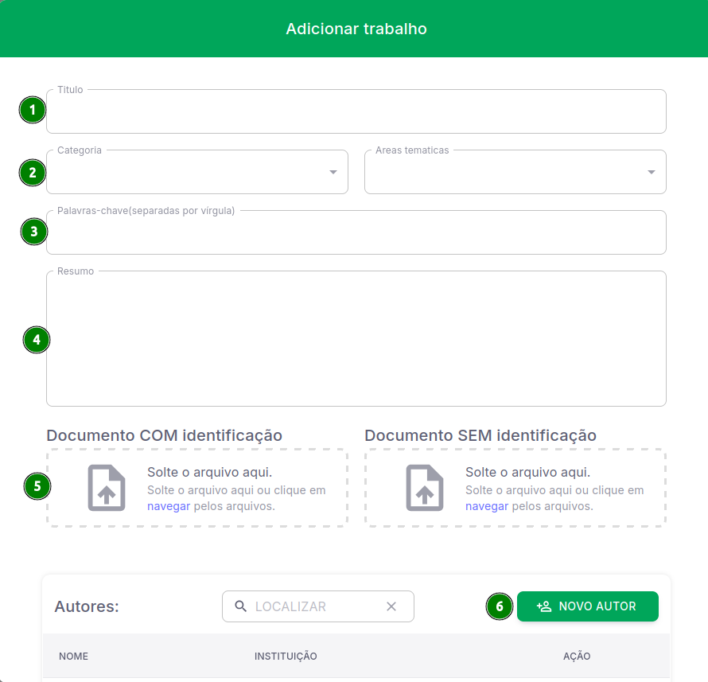
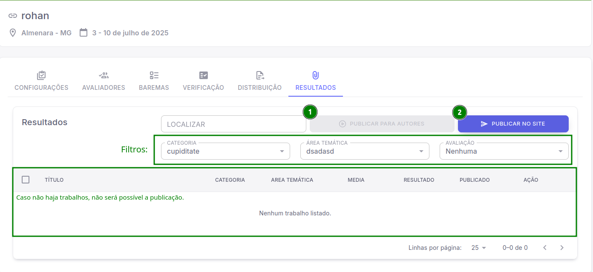

## Distribuição
 Essa aba é onde será feito a adição e atribuição de trabalhos para os avaliadores, nela é possível visualizar, editar, remover e atribuir individualmente ou em lote diversos avaliadores para as respectivas submissões de trabalho.

- [ 1 ] **Atribuição automática**
*Atribui entre os avaliadores os trabalhos automaticamente*

- [ 2 ] **Adicionar Trabalho**
*Cria um trabalho que é adicionado a listagem.*

**Filtros**:
* Categoria
* Área temática
* Avaliadores

**Funções da listagem:**
1. Finalizar Avaliação
2. Atribuir Avaliador
3. Visualizar trabalho
4. Excluir trabalho

### Criando trabalho
E o que precisamos fazer para criar um trabalho? Vamos aprender isso agora mesmo nessa etapa.

- [ 1 ] **Título**.

- [ 2 ] **Categoria e Áreas Temáticas**.

- [ 3 ] **Palavras-chave**

- [ 4 ] **Resumo**

- [ 5 ] **Documento com ou sem identificação**.

- [ 6 ] **Novo Autor**
*Ao clicar em Novo Autor, abrirá uma tela onde você pode inserir nome, e-mail e instituição do autor do trabalho*.

## Aba de Resultados
 A aba de resultados do sistema Pharus IFNMG, é responsável pela publicação dos resultados dos trabalhos de submissão do sistema, seja para os autores ou para o site.

 *Assim como demonstrado na imagem, o botão de **Publicar para Autores** ficará cinza caso não tenha nenhum autor e também será exibido "Erro ao atualizar publicação de resultados público." caso você tente **Publicar no Site** e não contenha submissão de trabalhos na listagem*.

- [ 1 ] **Publicar para Autores**
*Publica as informações de avaliação para os autores do trabalho*.
- [ 2 ] **Publicar no Site**
*Publica a lista de trabalhos aprovados no site, se os trabalhos estiverem cadastrados para apresentação essa informação também será exibida*.

**Filtros**:

* Categoria
* Área temática
* Avaliação

Após você localizar quais submissões de trabalhos, você pode fazer a escolha sobre a forma de publicação e em seguida publicar.