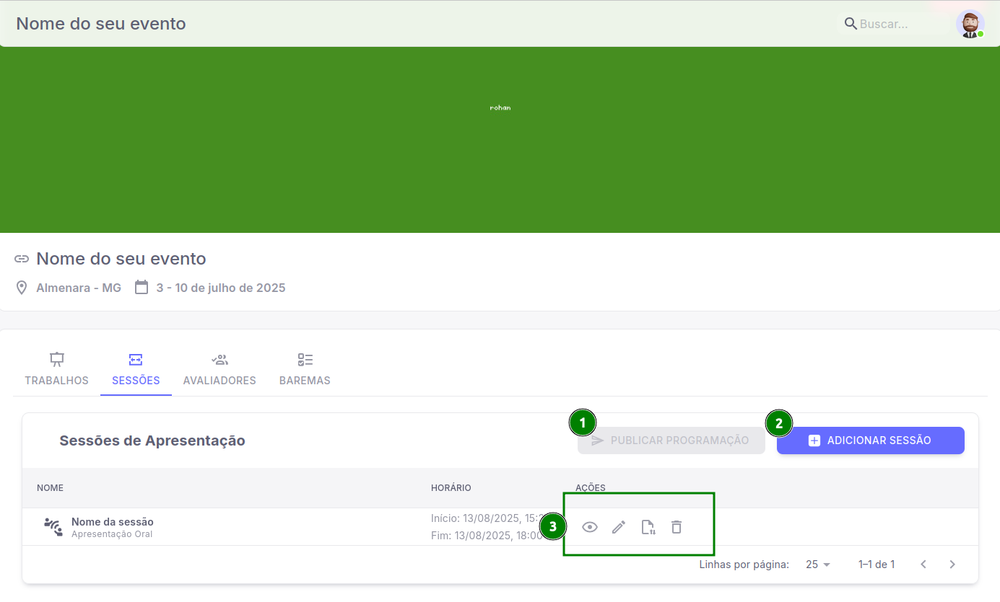

# Baremas para avaliação de apresentações

Dentro do Sistema do Pharus IFNMG, no módulo de **Apresentações** é possível o organizador visualizar a aprovação de trabalhos, adicionar ou publicar sessões de apresentação, importar e adicionar avaliadores e também adicionar um barema de avaliações.

## Primeiras etapas

 Assim que você entrar na área de **Apresentações**, a primeira aba que você irá visualizar será a aba de **Trabalhos**, onde é possível o organizador visualizar a aprovação dos trabalhos. 

 - Nessa aba, há diversos filtros de pesquisa de listagem para ajudar na visualização desses trabalhos, sendo eles *"Sessão, Área temática e Categoria"*.

 A próxima aba que iremos visualizar, é a aba de **Sessões** onde o organizador tem acesso as *Sessões de Apresentação*, com as permissões de *Adicionar, Publicar* e também *editar* ou *deletar* as sessões existentes.

1. **Publicar programações**: é possível publicar uma sessão, que ao ser publicada é disponibilizada a visualização para os autores do trabalho. *(Não é possível publicar sessões que não possuem trabalhos)*

2. **Adicionar Sessão:** ao clicar nesse botão, você será levado para um modal do qual terá alguns campos que você precisa inserir para adicionar uma sessão.

- [ 1 ] Nome da Sessão.
- [ 2 ] Tipo da apresentação *(Exemplo: Apresentação Oral, Apresentação de Poster...)*.
- [ 3 ] Local da Apresentação.
- [ 4 ] Duração em minutos da apresentação.
- [ 5 ] Data da sessão.
- [ 6 ] Horário de ínicio e término
- [ 7 ] Botão de inserção de  horário na **opção 6**.

3. **Campos adicionais**: Visualização da sessão criada, Editar sessão, Adicionar ou remover trabalhos da sessão e por fim a opção de remover.

## Etapas finais

Na aba seguinte, você conseguirá visualizar **Avaliadores**, onde é possível o organizador importar avaliadores já cadastrados no sistema do Pharus, para dentro da sua listagem nessa tela, não só isso, como também é possível adicionar cadastrar um avaliador que também aparecerá aqui, após finalizar o seu cadastro, e quais são esses campos?

- Para adicionar um avaliador você só precisará inserir nome e e-mail, selecionar qual área temática, marcar se você deseja enviar um e-mail de convite para esse avaliador e também definir o status do seu convite *(Aceito, pendente, recusado)*.

####
Finalizando essa etapa, vamos para a última aba chamada **Baremas**. Há nessa tela apenas o botão de **Adicionar Barema**, onde ao clicar exibirá uma outra tela para você inserir o *Nome do seu barema* e associar as *Sessões de apresentação* criadas anteriormente ao seu barema. 

Após você adicionar o seu barema, irá abrir uma nova tela te orientando a definir ou não, os critérios desse barema que são,

- [ 1 ] **Adicionar critério**: Botão inicial onde você irá clicar para que ele te dê as próximas opções de definição de critério.
- [ 2 ] **Campo Critério**: Defina o nome do seu critério
- [ 3 ] **Peso**: Você poderá definir a relevância do seu critério, com a relevância maior de peso sendo 10 e a menor 1.
- [ 4 ] Descrição do seu critério.

Finalizado essas configurações, apenas aperte em **Salvar** e pronto! Está tudo corretamente configurado para o seu evento.
