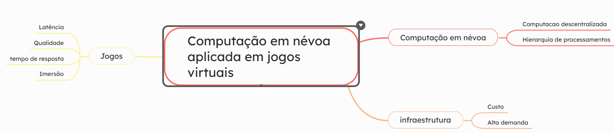

# Criar Evento
## Quando criar um evento? 

O **PHARUS** é uma plataforma de gestão de eventos que facilita a criação, organização e avaliação de eventos de maneira simples e eficiente. Para criar um evento no PHARUS, é essencial considerar alguns pontos importantes.

Primeiramente, é necessário definir o objetivo do evento e identificar o público-alvo. Vale destacar que o PHARUS suporta a criação de diversos tipos de eventos, como congressos, seminários, simpósios, cursos, workshops, entre outros.

Outro aspecto fundamental é a definição da data e do local do evento, além da carga horária e das atividades a serem realizadas. O planejamento cuidadoso é crucial, considerando todas as etapas envolvidas na organização do evento.

Por fim, é  importante divulgar todas as informações sobre o evento de forma clara e direta, para que os participantes possam obter as informações necessárias e realizar sua inscrição com facilidade. O PHARUS oferece várias opções de divulgação, incluindo a criação de páginas personalizadas do evento e o envio de e-mails para os participantes.

Com esses pontos em mente, você estará preparado para criar um evento no PHARUS com sucesso.

## Acessando opções de eventos
Para criar um novo evento, na tela inicial clique no botão azul, no canto superior direito onde está escrito: "Adicionar Evento"

imagem 

Logo após selecionar para adiocionar evento, 
