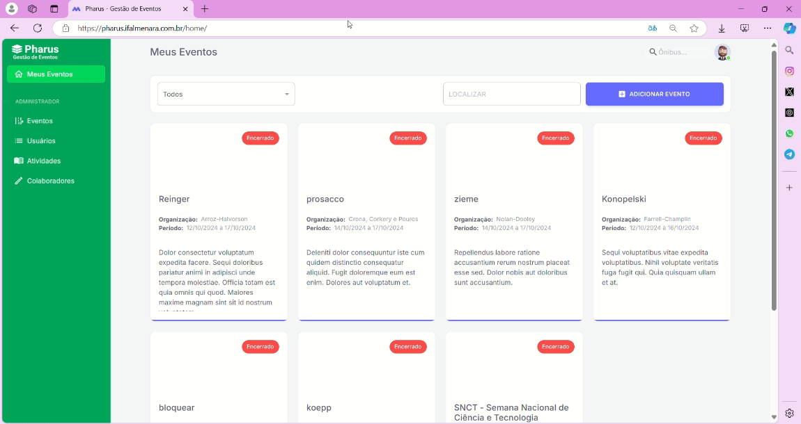
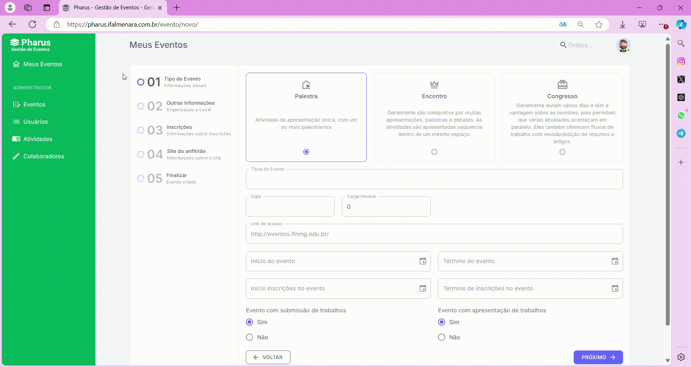
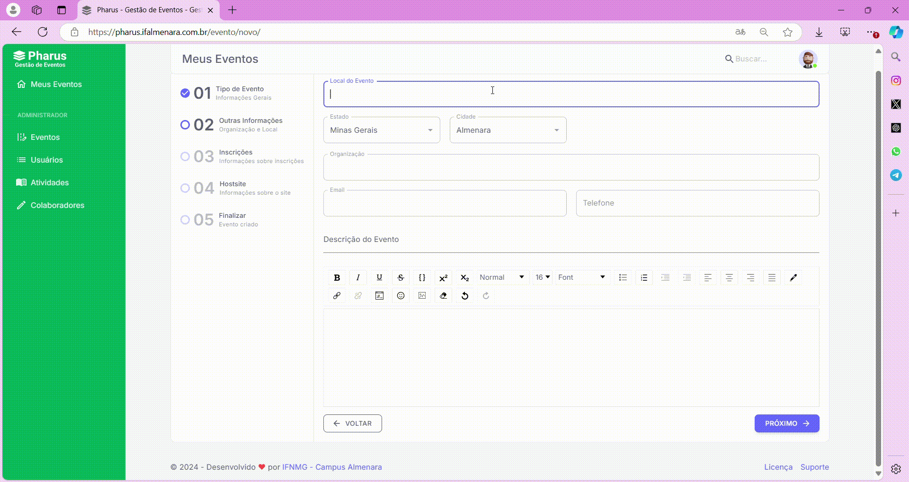
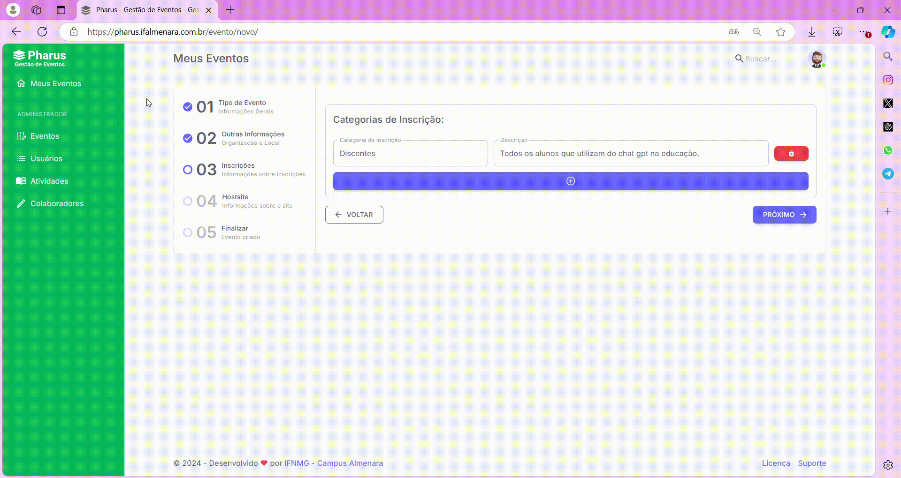

# Criar Evento
## Quando criar um evento?

O **PHARUS** é uma plataforma de gestão de eventos que simplifica a criação, organização e avaliação de eventos. Para criar um evento no PHARUS, considere os seguintes pontos:

Primeiro, defina o objetivo do evento e identifique o público-alvo. O PHARUS suporta diversos tipos de eventos, como congressos, seminários, simpósios, cursos e workshops.

Em seguida, determine a data, o local, a carga horária e as atividades do evento. Um planejamento cuidadoso é essencial para o sucesso do evento, abrangendo todas as etapas da organização.

Por fim, divulgue as informações do evento de forma clara e direta. Isso facilita a inscrição dos participantes. O PHARUS oferece várias opções de divulgação, incluindo a criação de páginas personalizadas e o envio de e-mails.

Com esses pontos em mente, você estará pronto para criar um evento no PHARUS com sucesso.

## Acessando opções de eventos

Para criar um novo evento, na tela inicial, selecione o botão "ESTOU ORGANIZANDO" e, em seguida, clique no botão azul no canto superior direito onde está escrito "Adicionar Evento".

### Tipo de Evento

Após selecionar "Adicionar Evento", aparecerá um menu com opções para escolher o tipo de evento que deseja cadastrar. Existem três tipos de eventos disponíveis: PALESTRA, ENCONTRO e CONGRESSO. O organizador deve escolher apenas um.

Em seguida, defina o nome do evento, a sigla e a carga horária. Preencha os campos de início e término do evento, bem como o período de inscrições.

O organizador também deve indicar se haverá submissão e apresentação de trabalhos. Selecione as opções apropriadas e clique no botão roxo no canto inferior direito, onde está escrito "PRÓXIMO".

### Outras Informações

Primeiro, preencha o LOCAL DO EVENTO e selecione o ESTADO e a CIDADE onde o evento ocorrerá. Depois, insira o nome do ORGANIZADOR DO EVENTO, o E-MAIL do organizador e o TELEFONE. Logo abaixo, adicione a DESCRIÇÃO DO EVENTO.

Em seguida, clique no botão roxo no canto inferior direito onde está escrito "PRÓXIMO".

### Categorias de inscrição

Nessa tela, preencha o campo "CATEGORIA DE INSCRIÇÃO" com a categoria do evento. No campo "DESCRIÇÃO", descreva o público-alvo do evento. Se houver apenas uma categoria, clique no botão roxo no canto inferior direito escrito "PRÓXIMO".

Caso queira adicionar mais uma categoria, clique no botão roxo de ADIÇÃO abaixo dos campos "CATEGORIA DE INSCRIÇÃO" e "DESCRIÇÃO". Preencha os novos campos e clique no botão roxo no canto inferior direito escrito "PRÓXIMO".

### Site do Evento

Na última tela, carregue a imagem do cabeçalho do site no campo "IMAGEM PARA CABEÇALHO DO SITE". Logo abaixo, carregue a logo marca do evento no campo "LOGO MARCA DO EVENTO". Escolha a cor do site no botão "SELECIONE A COR DESEJADA PARA O SITE". Selecione se o evento será publicado ou não no botão "PUBLICADO". Por último, finalize a criação do evento clicando no botão roxo no canto inferior direito escrito "FINALIZAR".

