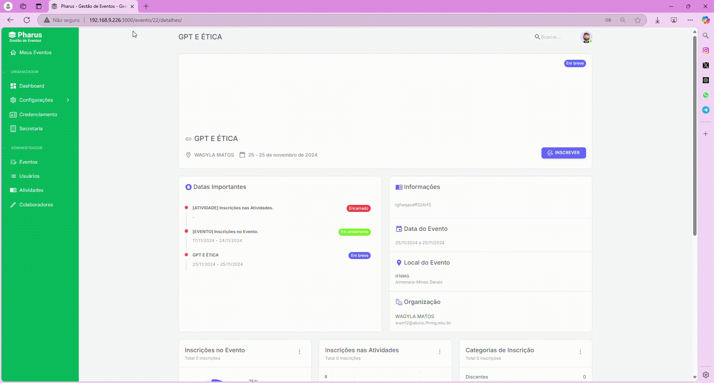

# Inscrição em Evento

## Realizando a Inscrição no Evento

O PHARUS é uma plataforma de gestão de eventos que simplifica todas as etapas, incluindo o processo de inscrição. Para se inscrever em um evento no PHARUS, siga os passos abaixo:

Primeiro, acesse a página do evento desejado. O PHARUS disponibiliza informações detalhadas, como descrição do evento e agenda. Certifique-se de revisar essas informações para garantir que o evento atenda às suas expectativas.

O PHARUS assegura uma interface intuitiva, facilitando o envio correto das informações.

Por fim, confirme a sua inscrição.

Com esses passos simples, você estará pronto para garantir sua participação em eventos organizados com o PHARUS.
## Meus Eventos

Inscrever-se em um evento no PHARUS é um processo simples e rápido, mas é importante estar atento aos detalhes para garantir que tudo seja feito corretamente.                                                    

Abaixo, explicamos como realizar sua inscrição de forma prática e segura, desde o acesso à página do evento até a confirmação final.

1- Selecione o Evento: escolha o evento desejado na lista disponível e clique no botão roxo com a inscrição "INSCREVER".                                                                               
2- Finalize a Inscrição: após selecionar o evento, clique no botão "FINALIZAR INSCRIÇÃO" para concluir o processo.                                                                           

Com isso, sua inscrição estará confirmada, e você estará oficialmente registrado no evento.                                               
