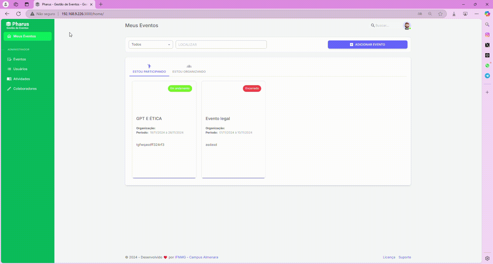

# Submissões: Editar uma submissão

No PHARUS, é possível editar uma submissão de atividade para corrigir informações ou atualizar detalhes conforme necessário.                                                    
Essa funcionalidade permite que os participantes ou organizadores ajustem títulos, horários, locais e outros dados, garantindo que a programação esteja sempre correta e atualizada.                                         

## Editando Submissão de Trabalho

Editar uma atividade no sistema Pharus é simples e requer atenção a alguns passos básicos.                                                           
A partir do menu de configurações do evento, você pode acessar a programação e visualizar as atividades submetidas. Confira abaixo o guia para realizar essa ação.                                                                                   

1- Acesse o evento onde a atividade está cadastrada.                                    
2- No menu à esquerda, clique em "Configurações".                                          
3- Na página de configurações, selecione a aba "Programação".                                             
4- Na nova tela, clique em "Atividade".                                                                       
Abaixo, você verá a lista de atividades submetidas.                                                  

1- Clique no ícone de lápis ao lado da atividade que deseja editar.                                                             
2- Agora, faça as alterações desejadas.                                                                                              
3- Clique em "Salvar" para confirmar as mudanças.
