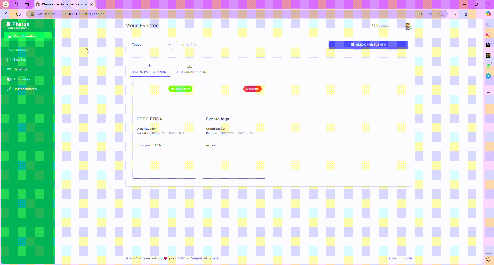

# Realizar inscrição em atividade do evento 
 No sistema PHARUS, para personalizar sua experiência, cada participante pode selecionar e se inscrever nas atividades de seu interesse.                                                                            
 Essa funcionalidade garante que você participe apenas das atividades que atendem aos seus objetivos e preferências, tornando sua jornada no evento ainda proveitosa.                                    

## Como Realizar a Inscrição em Atividades

Para se inscrever em uma atividade no sistema Pharus, siga estes passos simples:

1. Acesse a aba "Meus Eventos" após fazer login no sistema. Localize o evento no qual deseja realizar a inscrição e clique sobre ele.
2. Quando a página do evento carregar, procure no menu lateral esquerdo a opção "Atividades" e clique nela.
3. Uma lista com todas as atividades disponíveis será exibida. Encontre a atividade de seu interesse e clique no botão roxo "ADICIONAR ATIVIDADE".
4. Após adicionar todas as atividades desejadas, clique no botão roxo "FINALIZAR", que estará visível na parte supeior da tela.
5. Na próxima página, confirme sua inscrição clicando novamente no botão roxo "FINALIZAR INSCRIÇÃO".

Ao completar esses passos, sua inscrição na atividade será registrada com sucesso!